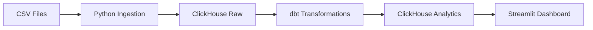

# 🏎️ F1 Analytics Pipeline

> Pipeline de análisis de datos de Fórmula 1 con ClickHouse, dbt y Streamlit

[](https://www.docker.com/)
[](https://www.getdbt.com/)
[](https://clickhouse.com/)
[](https://www.python.org/)

## 🎯 Descripción

Pipeline de datos moderno para análisis de Fórmula 1, diseñado con arquitectura ELT (Extract, Load, Transform) usando ClickHouse como base de datos OLAP columnar y dbt para transformaciones SQL. Incluye dashboards interactivos con Streamlit.

**Características principales:**
- 🗄️ **ClickHouse** - Base de datos columnar OLAP de alto rendimiento
- 🔄 **dbt** - Transformaciones SQL con tests y documentación
- 🐳 **Docker** - Despliegue containerizado
- 📊 **Streamlit** - Dashboards interactivos
- 📸 **Snapshots** - SCD Type 2 para historial de dimensiones
- ✅ **Calidad de datos** - Tests automatizados con dbt

## 🏗️ Arquitectura

Pipeline de datos implementado con tecnologías modernas:



**Stack tecnológico:**
- **Base de datos:** ClickHouse (OLAP columnar de alto rendimiento)
- **Transformación:** dbt (Data Build Tool)
- **Orquestación:** Docker Compose
- **Visualización:** Streamlit
- **Análisis:** Pandas

## 🚀 Inicio Rápido

### Prerrequisitos

```bash
# Docker y Docker Compose instalados
docker --version
docker-compose --version

# Conda (opcional, para desarrollo local)
conda --version
```

### Instalación

1. **Clonar el repositorio:**
```bash
git clone https://github.com/hlrd93/F1-analitica.git
cd F1-analitica
```

2. **Configurar variables de entorno:**
```bash
# Crear archivo .env en scripts/
cat > scripts/.env << EOF
CLICKHOUSE_HOST=clickhouse
CLICKHOUSE_PORT=9000
CLICKHOUSE_USER=default
CLICKHOUSE_PASSWORD=
EOF
```

3. **Levantar ClickHouse:**
```bash
docker-compose up -d clickhouse
```

4. **Ingestar datos:**
```bash
# Opción 1: Script Python (recomendado)
python scripts/load_csvs_to_clickhouse.py

# Opción 2: Script Shell
bash scripts/ingest_csvs_with_docker.sh
```

5. **Ejecutar transformaciones dbt:**
```bash
docker-compose up dbt-runner
```

6. **Lanzar dashboard:**
```bash
cd streamlit_app
streamlit run constructor_dashboard.py
```

## 📊 Estructura del Proyecto

```
F1/
├── datasets/               # CSV fuente de datos F1
│   ├── circuits.csv
│   ├── races.csv
│   ├── drivers.csv
│   ├── constructors.csv
│   └── ...
├── scripts/               # Scripts de ingesta
│   ├── load_csvs_to_clickhouse.py
│   └── ingest_csvs_with_docker.sh
├── dbt_project/          # Modelos dbt
│   ├── models/
│   │   ├── staging/      # Modelos fuente
│   │   ├── dim/          # Dimensiones
│   │   ├── fact/         # Hechos
│   │   └── marts/        # Data marts
│   └── snapshots/        # Snapshots SCD Type 2
├── streamlit_app/        # Dashboard interactivo
│   └── constructor_dashboard.py
├── docs/                 # Documentación MkDocs
└── docker-compose.yml    # Orquestación de servicios
```

## 🔄 Pipeline de Datos

### 1. Ingesta (Raw Layer)

Los datos CSV se cargan a ClickHouse en el schema `raw`:

```python
# scripts/load_csvs_to_clickhouse.py
# - Lee CSVs del directorio datasets/
# - Crea tablas raw.raw_<nombre>
# - Maneja valores nulos (\\N)
# - Carga por lotes (BATCH_SIZE=10000)
```

**Tablas raw disponibles:**
- `raw.raw_circuits`
- `raw.raw_races`
- `raw.raw_drivers`
- `raw.raw_constructors`
- `raw.raw_results`
- `raw.raw_constructor_results`
- Y más...

### 2. Transformación (Analytics Layer)

dbt transforma los datos raw en modelos analíticos:

```sql
-- dbt_project/models/staging/stg_races.sql
-- dbt_project/models/dim/dim_fecha.sql
-- dbt_project/models/fact/fact_race_results.sql
```

**Características:**
- ✅ Modelado dimensional (Star Schema)
- ✅ Tests de calidad de datos
- ✅ Documentación en `schema.yml`
- ✅ Snapshots SCD Type 2 para historial

### 3. Visualización

Dashboard Streamlit con análisis interactivo de constructores.

## 📚 Documentación

La documentación completa está disponible en formato MkDocs:

```bash
# Instalar dependencias
pip install mkdocs-material

# Servir localmente
mkdocs serve

# Abrir en navegador
open http://localhost:8000
```

**Contenido de la documentación:**
- 🏗️ [Arquitectura](docs/architecture.md) - Diagrama del pipeline
- 🔧 [Implementación](docs/implementation.md) - Referencias al código
- 📊 [Metodología](docs/metodologia.md) - Enfoque analítico
- 💉 [Ingesta](docs/ingestion.md) - Proceso de carga
- 📸 [Snapshots](docs/snapshots.md) - SCD Type 2
- 🎯 [Casos de uso](docs/use_case.md) - Ejemplos prácticos
- 📋 [ADR](docs/adr/) - Decisiones de arquitectura

## 🛠️ Desarrollo

### Entorno Conda

```bash
# Crear entorno
conda env create -f environment.yml

# Activar
conda activate f1-analytics

# Actualizar
conda env update -f environment.yml --prune
```

### Comandos útiles

```bash
# Ver logs de ClickHouse
docker-compose logs -f clickhouse

# Conectar a ClickHouse CLI
docker exec -it clickhouse clickhouse-client

# Ejecutar consultas SQL
docker exec -it clickhouse clickhouse-client --query "SELECT * FROM analytics.fact_race_results LIMIT 10"

# Ejecutar un modelo dbt específico
docker-compose run dbt-runner dbt run --select dim_fecha

# Ejecutar tests dbt
docker-compose run dbt-runner dbt test
```

## 📊 Análisis Exploratorio

El proyecto incluye análisis EDA detallado:

```bash
# Generar reporte EDA
python scripts/eda_pandas.py

# Ver reporte
cat datasets/eda_report.md
```

El reporte incluye:
- Estadísticas descriptivas
- Valores faltantes
- Distribuciones
- Valores únicos
- Top valores categóricos

## 🎓 Contexto Académico

Proyecto desarrollado para la Maestría en Ciencia de Datos de UCU.

**Requisitos cumplidos:**
- ✅ Modelado dimensional (Star Schema)
- ✅ Procesos ETL/ELT
- ✅ Dashboards de Business Intelligence
- ✅ Gestión de calidad de datos
- ✅ Documentación completa
- ✅ Snapshots para dimensiones lentamente cambiantes

## 🤝 Contribuciones

Este es un proyecto académico, pero el feedback es bienvenido. Para contribuir:

1. Fork el repositorio
2. Crea una rama feature (`git checkout -b feature/AmazingFeature`)
3. Commit tus cambios (`git commit -m 'Add some AmazingFeature'`)
4. Push a la rama (`git push origin feature/AmazingFeature`)
5. Abre un Pull Request

## 📄 Licencia

Este proyecto está bajo licencia MIT.

## 👤 Autor

**Herwin** - Maestría en Ciencia de Datos, UCU

🐙 [GitHub](https://github.com/hlrd93)

---

<p align="center">
  <sub>⭐ Si este proyecto te resulta útil, dale una estrella!</sub>
</p>
