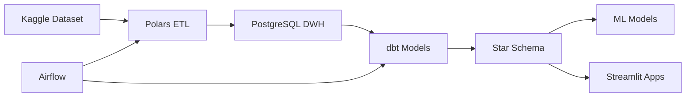

# 🏎️ F1 Analytics Platform

## Data Engineering Portfolio for EverPass Media Role

<div class="grid cards" markdown>

- :material-rocket-launch: **Quick Start**

    ---

    Get up and running in 5 minutes

    [:octicons-arrow-right-24: Installation Guide](setup/installation.md)

- :material-chart-line: **Strategy**

    ---

    EverPass-aligned technology choices

    [:octicons-arrow-right-24: Why These Technologies](strategy/why-everpass.md)

- :material-view-dashboard: **Architecture**

    ---

    System design and data flow

    [:octicons-arrow-right-24: Architecture Overview](architecture/overview.md)

- :material-calendar-clock: **Sprint Planning**

    ---

    12-week roadmap with deliverables

    [:octicons-arrow-right-24: View Sprints](sprints/sprint-01-02.md)

</div>

---

## Project Overview

**Modern data engineering platform for Formula 1 analytics**, built to demonstrate skills aligned with **EverPass Media's Data Engineer role requirements**.

### Core Objectives

1. **Academic Excellence** - Meet UCU Masters requirements with distinction
2. **Industry Readiness** - Match EverPass Media tech stack and competencies
3. **Portfolio Showcase** - Publicly deployed, production-quality system

### Technology Highlights

=== "Optimization Strategy"

    **Polars + dbt** for maximum performance
    
    - :zap: **10-100x faster** than traditional pandas pipelines
    - :gear: **Lazy evaluation** for memory efficiency  
    - :test_tube: **Automated testing** with dbt quality checks

=== "EverPass Alignment"

    **Direct match** with job requirements
    
    - :simple-apacheairflow: Apache Airflow - Workflow orchestration
    - :simple-postgresql: PostgreSQL - RDBMS expertise
    - :simple-python: Python/SQL - Core languages
    - :simple-docker: Docker - Containerization

=== "Data Scale"

    **Production-ready** architecture
    
    - :database: **70+ years** of F1 historical data
    - :chart: **29M+ records** annually processed
    - :rocket: **Real-time** prediction capabilities

---

## Quick Architecture Overview



---

## Key Features

### ✅ Data Warehouse
- **Dimensional modeling** (Star Schema)
- **dbt transformations** with lineage tracking
- **PostgreSQL + PostGIS** for geospatial analysis

### ✅ ML Pipeline
- **MLflow** experiment tracking
- **Predictive models** (position, points, fastest lap)
- **FastAPI** deployment for real-time predictions

### ✅ Orchestration
- **Apache Airflow** DAGs
- **Automated scheduling** and monitoring
- **Error handling** and retry logic

### ✅ Visualization
- **4 Streamlit apps** deployed on cloud
- **Interactive dashboards** with Plotly
- **Real-time predictions** integration

---

## Project Stats

| Metric | Value |
|--------|-------|
| **Tech Stack Components** | 12+ technologies |
| **Data Volume** | 29M+ rows/year |
| **Sprints** | 6 x 2-week cycles |
| **User Stories** | 14 detailed stories |
| **Expected Performance** | 10-100x pandas speedup |

---

## Getting Started

!!! tip "Ready to dive in?"
    
    Start with the [Quick Start Guide](getting-started.md) to set up your environment in 5 minutes!

### Prerequisites

- [x] Python 3.10+
- [x] Conda/Miniconda
- [x] Docker & Docker Compose
- [x] Git

### Installation

```bash
# Clone repository
git clone https://github.com/herwin/f1-analytics.git
cd f1-analytics

# Create environment
conda env create -f environment.yml
conda activate f1_analytics

# Start services
docker-compose up -d
```

[:octicons-arrow-right-24: Complete Installation Guide](setup/installation.md)

---

## Why This Matters

!!! quote "From the EverPass Job Posting"
    
    > "5+ years of experience in data engineering with a focus on **cloud-native architecture**"  
    > "Strong expertise in **Python, SQL, Airflow**"  
    > "Deep understanding **data modeling, database design, data warehousing**"

This project directly demonstrates these exact competencies with a **production-grade implementation**.

---

## Next Steps

<div class="grid cards" markdown>

- :material-map: **Explore the Strategy**

    ---

    Understand the technology choices

    [:octicons-arrow-right-24: EverPass Alignment](strategy/why-everpass.md)

- :material-code-braces: **Review Architecture**

    ---

    Deep dive into system design

    [:octicons-arrow-right-24: Architecture Details](architecture/overview.md)

- :material-calendar: **Follow Sprint Plan**

    ---

    Week-by-week implementation

    [:octicons-arrow-right-24: Sprint Roadmap](sprints/sprint-01-02.md)

- :material-school: **View User Stories**

    ---

    Detailed requirements breakdown

    [:octicons-arrow-right-24: User Stories](user-stories/foundation.md)

</div>

---

## Contact

**Herwin** - UCU Masters in Data Science  
📧 Email: [your.email@example.com](mailto:your.email@example.com)  
💼 LinkedIn: [linkedin.com/in/herwin](https://linkedin.com/in/herwin)  
🐙 GitHub: [github.com/herwin](https://github.com/herwin)

---

<p align="center">
  <strong>Built with ❤️ for EverPass Media and UCU Excellence</strong>
</p>
